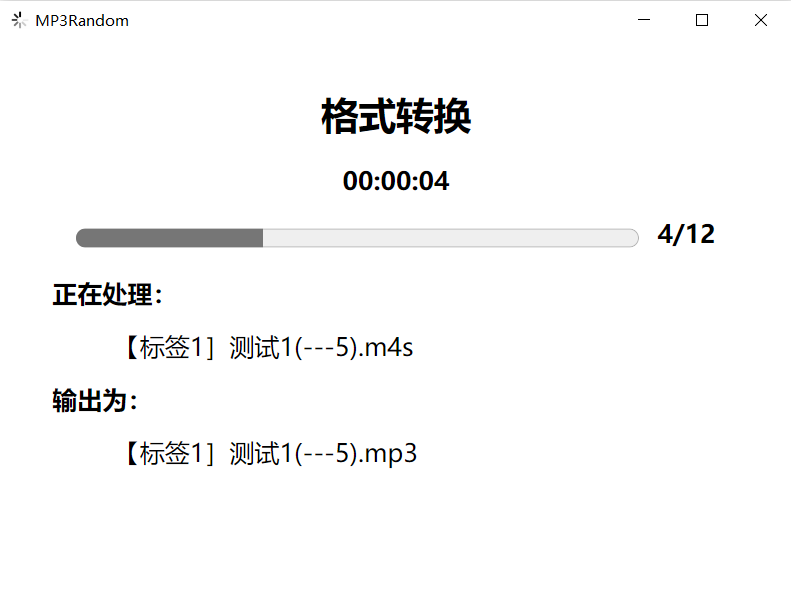
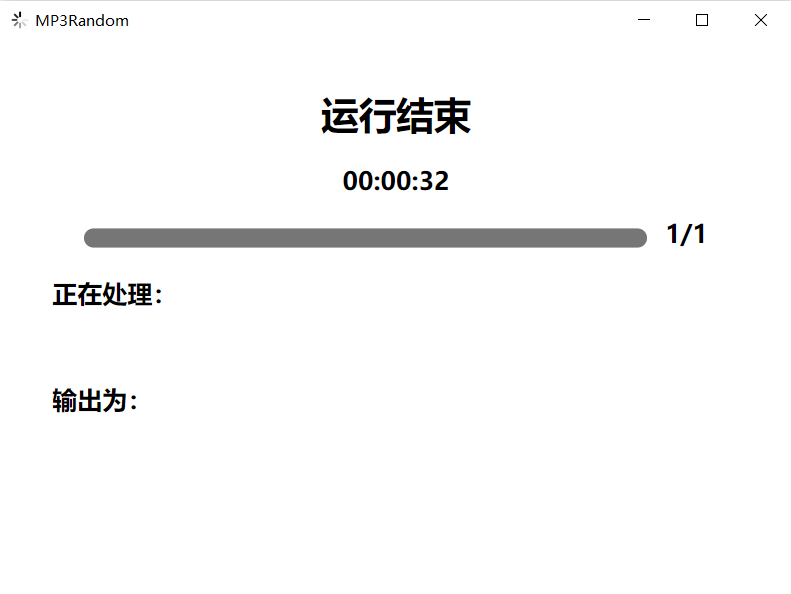
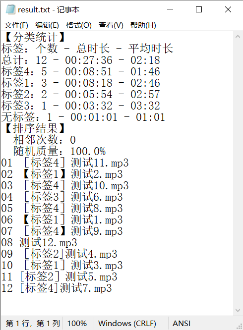

# MP3Random

## 简介

`MP3Random`是一个用于音乐文件操作的程序，主要用于按标签不相邻原则随机排列音乐文件，并统一音乐格式和音量。

主要功能有：

1. 格式转换：将音乐文件转换为mp3格式。
2. 音乐切片：将音乐文件按照指定时间切片。
3. 音量调整：调整音乐文件的音量。
4. 随机排列：按照标签不相邻原则，随机排列音乐文件。

## 使用

`dist`目录下的`MP3Random.exe`是一个可执行文件，下载后可直接运行，无需安装。

程序对音乐的操作基于`ffmpeg`和`mp3gain`，`dist`目录下的`ffmpeg.exe`和`mp3gain.exe`
是程序的依赖文件，程序会自动调用这两个文件，也可自行下载并配置在系统环境变量中。

也可以通过源码运行，需要安装Python3.8及以上版本，并安装依赖库：

```shell
pip install -r requirements.txt
```

其中包括 `pywebview` 和 `mutagen` 两个库。

## 依赖

程序依赖于以下软件：

1. `ffmpeg`：用于音频格式转换和切片。

   `ffmpeg`是一个开源的音视频处理工具，可以处理音频、视频等多种格式的文件(https://ffmpeg.org/)
   。本程序使用的版本为基于`LGPL`开源的[BtbN](https://github.com/BtbN/FFmpeg-Builds/releases)
   打包的版本[ffmpeg-master-latest-win64-lgpl.zip](https://github.com/BtbN/FFmpeg-Builds/releases/download/latest/ffmpeg-master-latest-win64-lgpl.zip)。

2. `mp3gain`：用于音频音量调整。

   `mp3gain`是一个开源的音频音量调整工具，可以调整音频文件的音量(https://mp3gain.sourceforge.net)
   。本程序使用的版本为基于`LGPL`
   开源的[mp3gain-dos-1_5_2.zip](https://sourceforge.net/projects/mp3gain/files/mp3gain/1.5.2/mp3gain-dos-1_5_2.zip/download)
   ，即`mp3gain`命令行版本。

源代码还依赖于以下Python库：

1. `pywebview`：用于程序的图形界面。

   `pywebview`是一个Python库，可以将Web页面嵌入到Python程序中，用于构建图形界面(https://pywebview.flowrl.com/)，基于`BSD`
   协议开源。

2. `mutagen`：用于音频文件的标签读取。

   `mutagen`是一个Python库，用于读取音频文件的标签信息(https://mutagen.readthedocs.io/)，基于`GPL`开源。

## 操作演示

打开程序，其主界面，也即操作界面如下：


**⚠警告：请确保所选目录内仅有音乐文件，目录内的任何文件均将作为音乐文件进行处理！**

打开程序后，将检测ffmpeg和mp3gain是否存在于当前目录或系统环境变量中，如果不存在，将提示❌，此时可单击该按钮选择对应的文件。

使用时，共可选四个过程：`格式转换`、`音乐切片`、`音量调整`、`随机排列`。

1. `格式转换`：将音乐文件转换为mp3格式。

   选择`格式转换`，程序将`转换前音乐目录`内的文件转换为`mp3`格式，并保存在`转换后音乐目录`下。

2. `音乐切片`：将音乐文件按照指定时间切片。

   选择`音乐切片`，程序将`转换后音乐目录`内的文件按照`起始时间`和`结束时间`进行切片，并保存在原目录下。

   **⚠警告：音乐切片不可逆，且将删除切片前文件！程序不会对切片前音乐进行备份！**

3. `音量调整`：调整音乐文件的音量。

   选择`音量调整`，程序将`转换后音乐目录`内的文件按照`音乐音量调整至`进行调整，为直接操作原文件。

4. `随机排列`：按照标签不相邻原则，随机排列音乐文件。

   选择`随机排列`，程序将`转换后音乐目录`内的文件按照标签不相邻原则进行随机排列，并保存在`随机排列后目录`下。

单击`开始`按钮，程序将开始执行所选过程，程序运行时界面如下：



程序运行时，界面将被锁定，无法进行其他操作，直至程序运行结束。

> 注：若此时需要终止操作，可直接关闭程序，程序将自动终止当前操作。

程序运行结束后，将显示如下界面，此时可直接关闭程序即可：



程序运行完成后，即可在各文件夹下查看对应的文件，其中`结果文件输出至`保存了音乐的信息，包括按照标签的分类统计，及排序的结果，示例如下：



> 注：随机质量为0-100%，随机质量越大，代表本次随机越无序，随即质量越小，代表本次随机越有序。其大小不表示随机体感的好坏。

## 命名格式

音乐文件的命名格式为：

```shell
[标签]文件名（起始时间-结束时间）.后缀名
```

1. 方括号扩中的是标签，支持`【】`、`[]`、`［］`三种格式括号的识别；

   方括号必须放在最前面，否则识别不到；

   如果没有则识别为`无标签`。

2. 圆括号中的是起止时间，用于裁剪音乐，中间必须为`-`否则不识别，支持`（）`、`()`两种格式括号的识别；

   圆括号可以放在任意位置；

   如果没有则认为无需切割；

   起止时间可以设置任意数字或字符串，以秒为单位，支持负数，符号同样为`-`，超出预计的`-`
   符号会导致识别失败，负数代表从结尾往前切割，最多支持四位小数，字符串（包括空字符串）代表不切割该方向；

   如果有多个符合格式的圆括号，会以最后一个为准，其他作为名称的一部分。

   示例如下：

    1. `（----）`、`（5---）`、`（备注）`均将识别失败，不进行切割且将其视为文件名的一部分；

    2. `（---5）`识别为“-”、“-5”，视为从开头到倒数5s进行切割；`（--5）`识别为“”、“-5”，视为从开头到倒数5s进行切割；`（5--）`
       识别为“5”、“-”，视为从5s到结束进行切割；`（5-）`识别为“5”、“”，视为从5s到结束进行切割；`（-5）`识别为“”、“5”，视为从开头到5s进行切割；

    3. `（---）`识别为“-”、“-”代表从开始到结束进行切割；

    4. `（0--10）`识别为“0”、“-10”代表从0s到倒数10s进行切割；

    5. `（-15--5）`识别为“-15”、“-5”代表从倒数15s到倒数5s进行切割；

3. 如果没有文件名，或文件名在去除起止时间后为空，或文件名重复，则自动在文件名后添加`_2`以免出现错误。

## TODO

1. 随机排列文件的输出命名支持标签和文件名的可选输出（已支持该操作，但未添加到界面）。
2. `mutagen`库替换为其他库，以减少依赖。
3. 界面美化。
4. 初始化路径的快速设置和替换（当前仅支持自动设置为当前目录）。
5. 测试用例的编写。
6. 分离前后端逻辑，以便于后续的扩展。
7. 结果输出txt文件的增加（当前仅随机排列后输出）。
8. 是否从`ffmpeg`和`mp3gain`中提取所用到的源代码，嵌入到程序中，以减少依赖和程序大小。
9. 标签调整功能的增加。

## 作者

`MP3Random`由[凌乱之主](https://github.com/lingluan7-315)开发。

程序采用LGPL协议开源，源代码托管在[GitHub]()上。